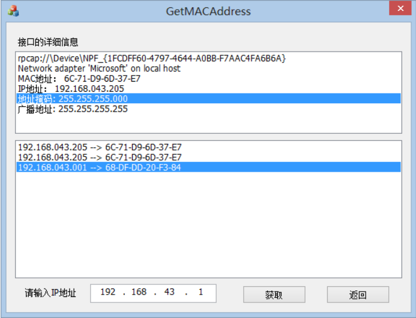
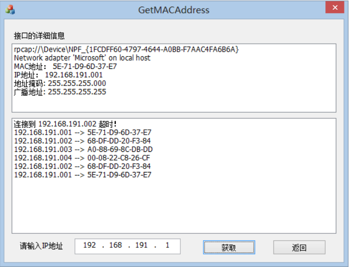

# 利用 ARP 协议获取 IP 地址与 MAC 地址的对应关系

## 一、 实验要求介绍
在以太网中，获取 MAC 地址常常是其他工作的前提。本实验要求利用WinPcap 提供的功能获取以太网中主机的 MAC 地址。通过本实验不但可以学习 ARP 的工作过程，而且可以深入了解 IP 地址和 MAC 地址的有关概念。

本实验的目的是获取以太网中主机的 MAC 地址，因此以太网在该实验中是必不可少的。本实验使用的以太网既可以是共享式以太网，也可以是交换式以太网。

## 二、 实验编译运行环境 

本程序编译环境是：Visual Studio 2012；系统环境是：Windows 8（64位）；

## 三、 编写 IP 数据报捕获与分析软件运行效果
程序最终界面如下：

程序在以太网中测试界面如下：

程序首先在上面的窗口显示接口的详细信息，包括网络接口设备的名字、设备的描述信息、MAC 地址、IP 地址、地址掩码和广播地址。

在下面的窗口显示该以太网中输入的 IP 地址与对应的 MAC 地址。其中通过下方的 IP 地址控件输入想要获得对应 MAC 地址的 IP 地址，通过点击“获取”按钮获取对应关系，若获取成功则显示“xxx.xxx.xxx.xxx(IP 地址)  xxxx-xx-xx-xx-xx(MAC地址)”，否则则显示“连接到 xxx.xxx.xxx.xxx(IP 地址)超时！”。

当点击“返回”按钮之后会清空列表框中的内容。

## 四、其他

实验原理和程序实现步骤及代码见代码和文档

